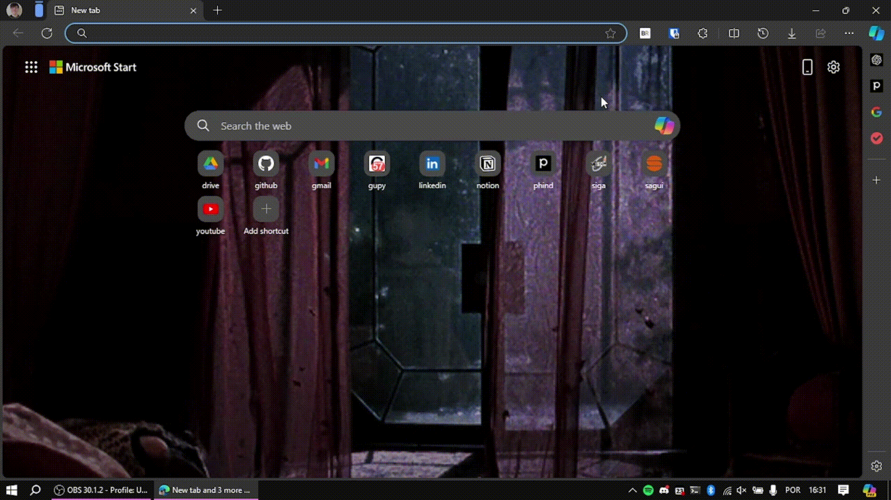
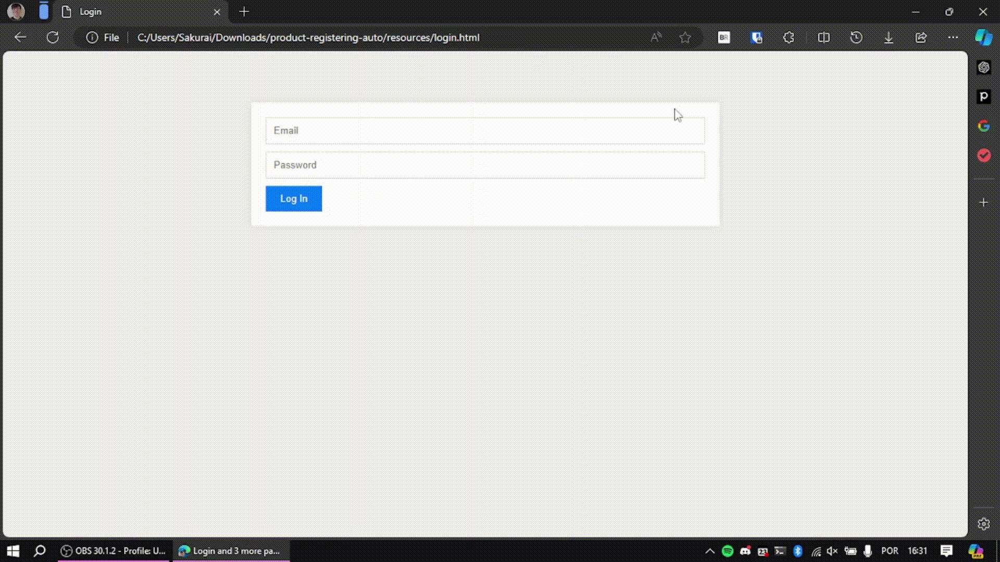
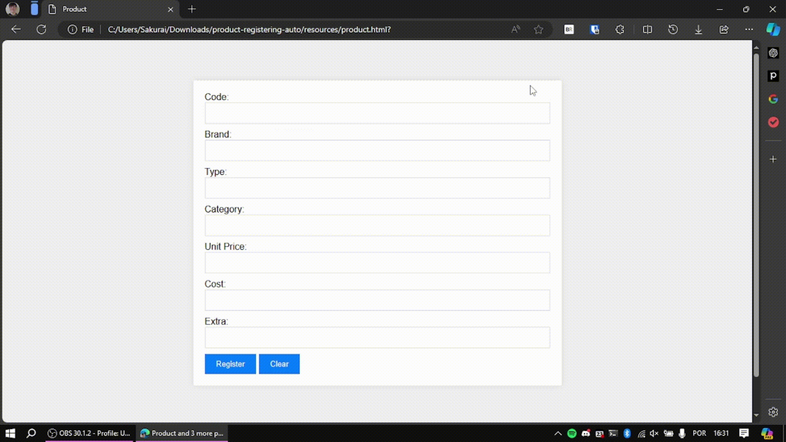
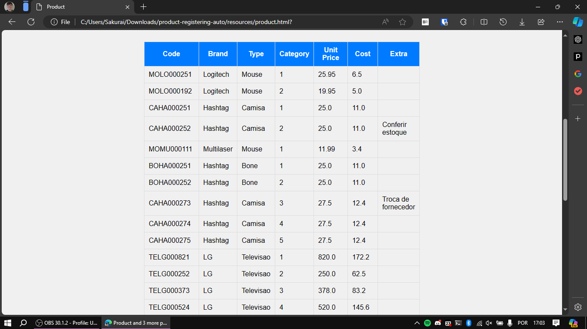

# ⚙️ Automation: Product Registering in CRUD ⚙️

An automation project that reads a CSV file and registers products in a system. The libraries used in this project were:
- Pandas: for handling the CSV;
- PyAutoGUI: for handling GUI manipulation.

## 🗺️ Steps

### Open Browser

### Open Website

### Login

### Register Products

## End Result

You can see the registered products in the table below the form:

